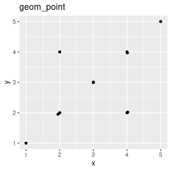
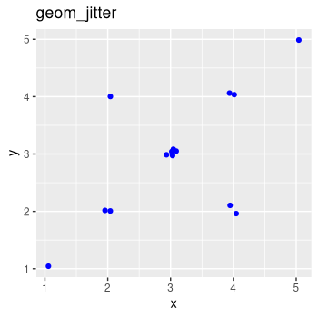
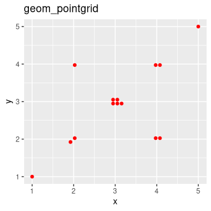

# ggpointgrid

This package provides a simple geom (`geom_pointgrid`) derived from `geom_point` that rearranges the input points for a scatterplot on a regular grid while strictly avoiding over-plotting. The applications might be similar to `geom_jitter`.

### Example

```
library(ggplot2)

testdata <- data.frame(
  x = c(1, 2, 1.95, 2, 3, 3, 3, 3, 3, 4, 4.02, 4, 4.01, 5),
  y = c(1, 2, 1.95, 4, 3, 3, 3, 3, 3, 2, 2.02, 4, 3.97, 5)
)

ggplot(testdata, aes(x, y)) +
  geom_point() +
  geom_jitter(color = "blue", width = 0.1, height = 0.1) +
  ggpointgrid::geom_pointgrid(color = "red", grid_x = 40, grid_y = 40)
```
  

### Installation

You can install the development version from github with the following command (in your R console):

```
if(!require('remotes')) install.packages('remotes')
remotes::install_github("nevrome/ggpointgrid")
```
