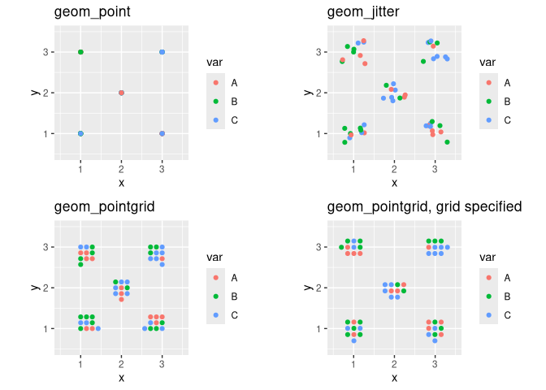
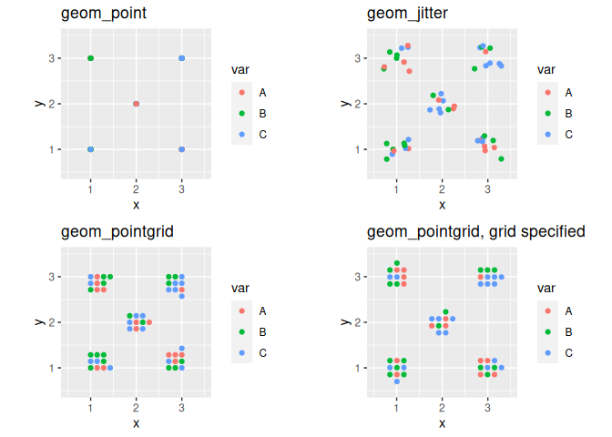

<!-- README.md is generated from README.Rmd. Please edit that file -->

# ggpointgrid

This package provides a core algorithm, a [ggplot2
`stat`](https://ggplot2.tidyverse.org/reference/layer_stats.html), and
multiple [ggplot2
`geom`s](https://ggplot2.tidyverse.org/reference/layer_geoms.html) to
rearrange point coordinates on regular grids. This has multiple
applications, but primarily serves to strictly avoid overplotting in
scatter plots. It is useful in situations where every individual
observation should be clearly distinguishable.

### Blog posts

- **Labelling:** `geom_textgrid` and `geom_labelgrid` perform the same
  arrangement operation for text labels as `geom_pointgrid` does for
  points. `geom_segmentgrid` draws segments between the original point
  positions and the new grid positions. Together these geoms enable a
  mechanism for label plotting in scatter plots and maps. This post
  shows three examples of this feature:
  <https://nevrome.de/blog/posts/2026-05-18-labelling-with-ggpointgrid.html>
- **Futhark:** ggpointgrid uses [futhark](https://futhark-lang.org) for
  the implementation of its essential algorithms. Read more about this
  special setup here:
  <https://nevrome.de/blog/posts/2026-01-12-futhark-in-ggpointgrid.html>.

### Installation

You can install the development version from GitHub with the following
command (in your R console):

    if(!require('remotes')) install.packages('remotes')
    remotes::install_github("nevrome/ggpointgrid")

Windows users will need the
[Rtools](https://cran.r-project.org/bin/windows/Rtools/) to build the
package.

### Examples

#### Point arrangement with `geom_pointgrid`

`geom_pointgrid` aims to optimize the arrangement of observations on a
regular grid. This works well for figures with continuously scaled x-
and y-axes, so for scatter-plots or even map plots. Just as in
`geom_jitter` the rearrangement of the points reduces accuracy and
precision of positional information on x and y in favour of making
**every** observation visible.

The grid properties are controlled with the parameters `grid_x` and
`grid_y`, which allow to precisely specify the desired graticules.

``` r
library(ggplot2)
set.seed(5) # the seed is for geom_jitter

df <- tibble::tibble(
  x = rep(c(1,1,2,3,3), times = 10),
  y = rep(c(1,3,2,1,3), times = 10),
  var = sample(c("A", "B", "C"), size = 50, replace = T)
)

coord <- coord_fixed(xlim = c(0.5,3.5), ylim = c(0.5,3.5))

p1 <- ggplot(df) +
  geom_point(aes(x, y, color = var)) +
  coord + ggtitle("geom_point")

p2 <- ggplot(df) +
  geom_jitter(aes(x, y, color = var), width = 0.3, height = 0.3) +
  coord + ggtitle("geom_jitter")

p3 <- ggplot(df) +
  ggpointgrid::geom_pointgrid(aes(x, y, color = var), grid_x = 15L, grid_y = 15L) +
  coord + ggtitle("geom_pointgrid")

p4 <- ggplot(df) +
  ggpointgrid::geom_pointgrid(
    aes(x, y, color = var),
    grid_x = seq(min(df$x) - 0.3, max(df$x) + 0.3, length.out = 18),
    grid_y = seq(min(df$y) - 0.3, max(df$y) + 0.3, length.out = 18)
  ) +
  coord + ggtitle("geom_pointgrid, grid specified")

cowplot::plot_grid(p1, p2, p3, p4)
```

<!-- -->

#### Point arrangement with `geom_pointrect`

`geom_pointrect` was designed for a slightly different use-case than
`geom_pointgrid`. Here all observations that share the x- and
y-coordinate are spread out into a rectangular grid, representing only
this one position. This is especially useful, when the x- and y- axis
are ordinally scaled.

The order within each rectangle can be set by the order of the input
data.frame and the arguments `scale_x` and `scale_y` control the size of
the per-position box. The arguments `round_x` and `round_y` allow to
specify how data on continuously scaled x- and y-axes should be
aggregated.

``` r
df <- tibble::tibble(
  x = rep(letters[c(1,1,2,3,3)], times = 10),
  y = rep(letters[c(1,3,2,1,3)], times = 10),
  var = sample(c("A", "B", "C"), size = 50, replace = T)
) |> dplyr::arrange(var)

coord <- coord_fixed()

p4 <- ggplot(df) +
  geom_point(aes(x, y, color = var)) +
  coord + ggtitle("geom_point")

p5 <- ggplot(df) +
  geom_jitter(aes(x, y, color = var), width = 0.3, height = 0.3) +
  coord + ggtitle("geom_jitter")

p6 <- ggplot(df) +
  ggpointgrid::geom_pointrect(aes(x, y, color = var)) +
  coord + ggtitle("geom_pointrect")

p7 <- ggplot(df) +
  ggpointgrid::geom_pointrect(
    aes(x, y, color = var),
    scale_x = 0.2,
    scale_y = 0.2
  ) +
  coord + ggtitle("geom_pointrect, scaling set")

cowplot::plot_grid(p4, p5, p6, p7)
```

<!-- -->
