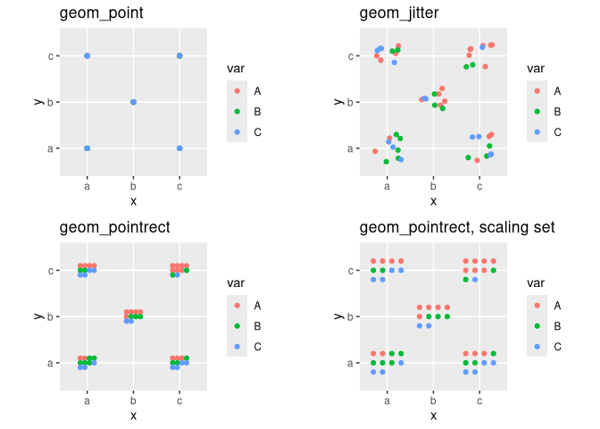

<!-- README.md is generated from README.Rmd. Please edit that file -->

# ggpointgrid

This package provides some simple geoms (`geom_pointgrid`,
`geom_pointrect`) derived from geom\_point to rearrange scatterplot
coordinates on regular grids while strictly avoiding over-plotting. The
applications might be similar to `geom_jitter`.

### Installation

You can install the development version from github with the following
command (in your R console):

    if(!require('remotes')) install.packages('remotes')
    remotes::install_github("nevrome/ggpointgrid")

### Example

``` r
mtcars %>%
  ggplot() +
  ggpointgrid::geom_pointgrid(
    aes(x = mpg, y = disp, shape = factor(carb), color = mpg),
    grid_x = 15,
    grid_y = 15
  )
```

<!-- -->

``` r
mtcars %>%
  ggplot() +
  ggpointgrid::geom_pointrect(
    aes(x = factor(vs), y = factor(gear), shape = factor(carb), color = mpg), 
    scale_x = 0.05, 
    scale_y = 0.12 
  )
```

<!-- -->
